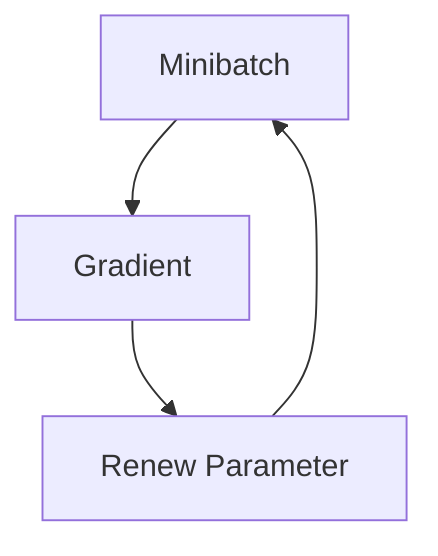

# May 25th, Diary 1

## Summary

In today's learning, I learned the concept of **loss function**, **gradient**, and the application of gradient in **gradient descent**. 

Also, since some codes written by the author may not be so convenient for usage in my environment, I rewrite some codes both for **practice** and for **convenience**. 

Here is something I learned in today's studying:

## 1. How to import Mnist Dataset from tensorflow:
Here's the code I adapt. More friendly for me to use:
```
from tensorflow.keras.datasets import mnist
import numpy as np

def load_mnist(flatten = True, normalize = True):

	(x_train, t_train), (x_test, t_test) = mnist.load_data()
	
	if normalize:
		x_train = x_train.astype(np.float32) / 255.0
		x_test = x_test.astype(np.float32) / 255.0
	
	if flatten:
		x_train = x_train.reshape(x_train.shape[0], -1)
		x_test = x_test.reshape(x_test.shape[0], -1)
	
	return (x_train, t_train), (x_test, t_test)
```
## 2. Concept of Loss Function:
In classification problems, using _**softmax** function_:
```
def softmax(x):
	c = np.max(x)
	exp_x = np.exp(x - c)
	sum_exp_x = np.sum(exp_x)
	return exp_x / sum_exp_x
```
we are able to **infer** the most possible outcome. But the recognition rate is often discrete and thus not learnable, so we define **loss function** as a continuous indicator of the learning effect. Two functions are introduced:

### Mean Sqaure Error :
```
def softmax(x):
  return 0.5 * np.sum((y-t)**2)
```
This function focuses on how far you deviate from the correct label.

**y** is the predicted result, **t** is the one-hot label of correct answer. 
### Cross Entropy Error:
Sometimes, neural networks will give wrong answers very confidently, which should receive more punishment than what they receives from MSE loss function. Therefore, **cross entropy error** function is used:
```
def cross_entropy_error(y, t):
  return -np.sum(t * np.log(y + 1e-7)) 

# log: greatly enlarge the difference between prediction results (<=1)
#      and real labels

# t * np.log(): t is one-hot label; all the other prediction results are
#               ignored because their corresponding labels are 0.

# 1e-7: log(0) -> ∞, so we use a small value to prevent blowup

# "-": np.log() are always negative; we want positive "loss"
```

## 3. Gradient
We use _**center differentiation method**_ to express differentiation:
```
def numerical_diff(f, x):
	h = 1e-4
	return (f(x+h) - f(x-h)) / (2*h)
```
and this function to express gradient, which is differentiation on each variable:
```
def numerical_gradient(f, x):
	h = 1e-4
	grad = np.zeros_like(x)

	for idx in range(x.size):
		tmp_val = x[idx]
		x[idx] = tmp_val + h
		fxh1 = f(x)

		x[idx] = tmp_val - h
		fxh2 = f(x)

		grad[idx] = (fxh1 - fxh2) / (2*h)
		x[idx] = tmp_val
	
	return grad
```
## 4. Gradient Descent:
We know that, even though saddle points may exist, along the direction of gradient could the loss function decrease the most rapidly. Utilizing this property, we could find a point making loss function as small as possible. 

Therefore, we use **gradient descent** method to find the minimum point:

$$
x' = x - \eta \nabla f(x)
$$

Code is here:
```
def gradient_descent(f, init_x, lr = 0.01, step_num = 100):
	x = init_x

	for i in range(step_num):
		grad = numerical_gradient(f, x)
		x -= lr * grad

	return x
```
**lr** is _learning rate_. If it is too large, final results blows up; if too small, final results do not converge enough. 

## 5. Flowchart of Neural Network:



